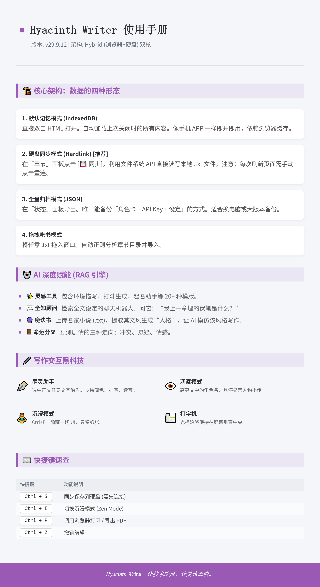

# 🪶 Hyacinth Writer (风信子作家)

> **v29.9.12 - ZeroGravity Edition**
>
> *English Abstract: A Zero-Gravity, Local-First AI Writing Workstation. Built with Vue 3 in a single HTML file. Supports RAG memory, local file system syncing, and custom AI providers (Ollama/OpenAI).(Currently optimized for Chinese language users, English localization coming soon).*

## ✨ 核心特性 (Features)

- **🚀 零重力部署 (Zero-Gravity)**：单文件 HTML，无需安装，双击即用，可存入 U 盘随身携带。
- **🔒 数据绝对主权 (Local-First)**：基于 IndexedDB + File System Access API。文章只存浏览器和本地硬盘，绝无云端上传。
- **🤖 RAG 记忆引擎 (Archivist)**：内置向量检索，AI 能“读懂”你的前文伏笔和设定，而非仅仅通过上下文窗口。
- **✒️ 墨灵助手 (Ink Spirit)**：沉浸式悬浮交互，支持润色、续写、扩写。
- **🔌 全模型兼容 (Universal API)**：支持 DeepSeek, Claude, Gemini 以及 **本地 Ollama** (支持 OpenAI 兼容接口配置)。

## 📦 如何使用 (Usage)

### 方式一：在线体验 (推荐)
👉 [点击这里直接使用 Hyacinth Writer](https://Charllote99.github.io/hyacinth-writer/)
*(数据依然只保存在你的本地浏览器中)*

### 方式二：离线使用 (极客推荐)
1. 点击右上角绿色 `Code` 按钮 -> `Download ZIP`。
2. 解压后，双击 `index.html` 即可运行。

## 🛠️ 配置指南

1. 点击右上角 **⚙️ 设置**。
2. 在 **模型 (Model)** 选项卡中，选择厂商或点击 **Custom (自定义)**。
3. 填入你的 API Key 和 Base URL (例如本地 Ollama填 `http://localhost:11434/v1/chat/completions`)。
4. 点击检查连通性。

## ☕ 支持作者 (Sponsor)

Hyacinth Writer 是一个完全免费的开源项目。
我是一名独立开发者，如果你喜欢这个工具，或者它帮助你写出了精彩的故事，欢迎请我喝一杯咖啡，这将是我继续更新的最大动力！❤️

## 📄 版权说明 (License)

本项目采用 **[CC BY-NC-SA 4.0](https://creativecommons.org/licenses/by-nc-sa/4.0/deed.zh)** 协议进行许可。

- ✅ **您可以**：自由下载、使用、修改源码、分享给朋友。
- ❌ **严禁商用**：禁止将本项目打包售卖、植入广告或用于商业收费服务。
- 📢 **转载请注明**：原作者 [Charllote99]。

---
*Made with ❤️ by [Charllote99] & AI Assistant*
